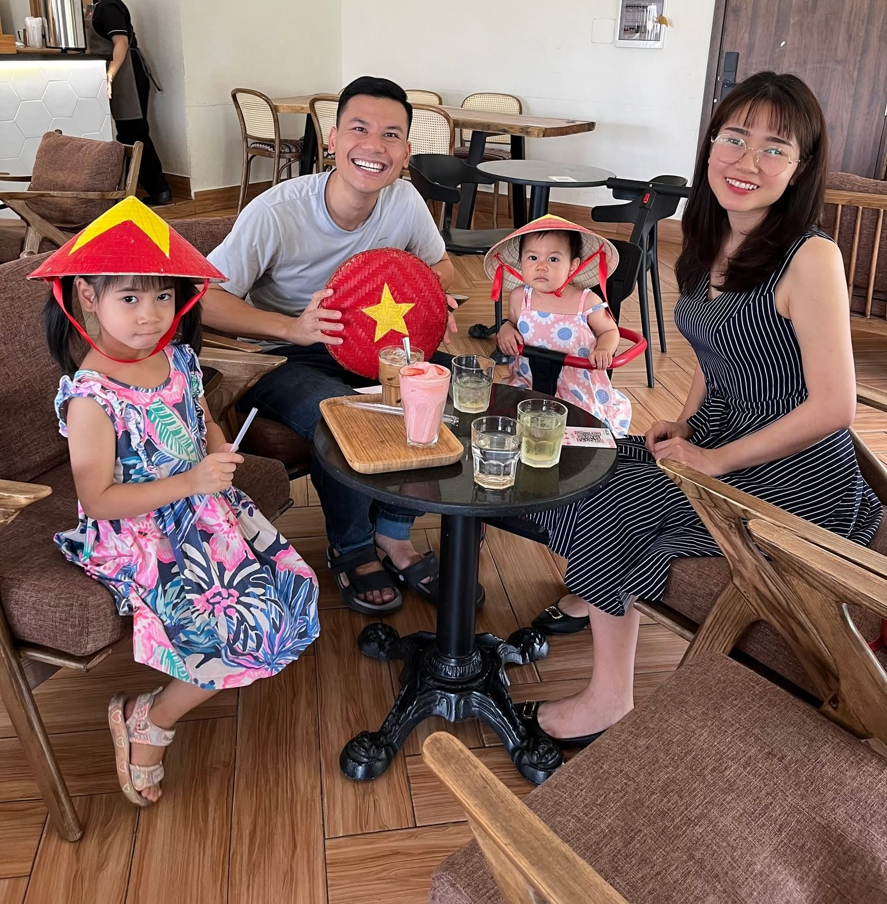
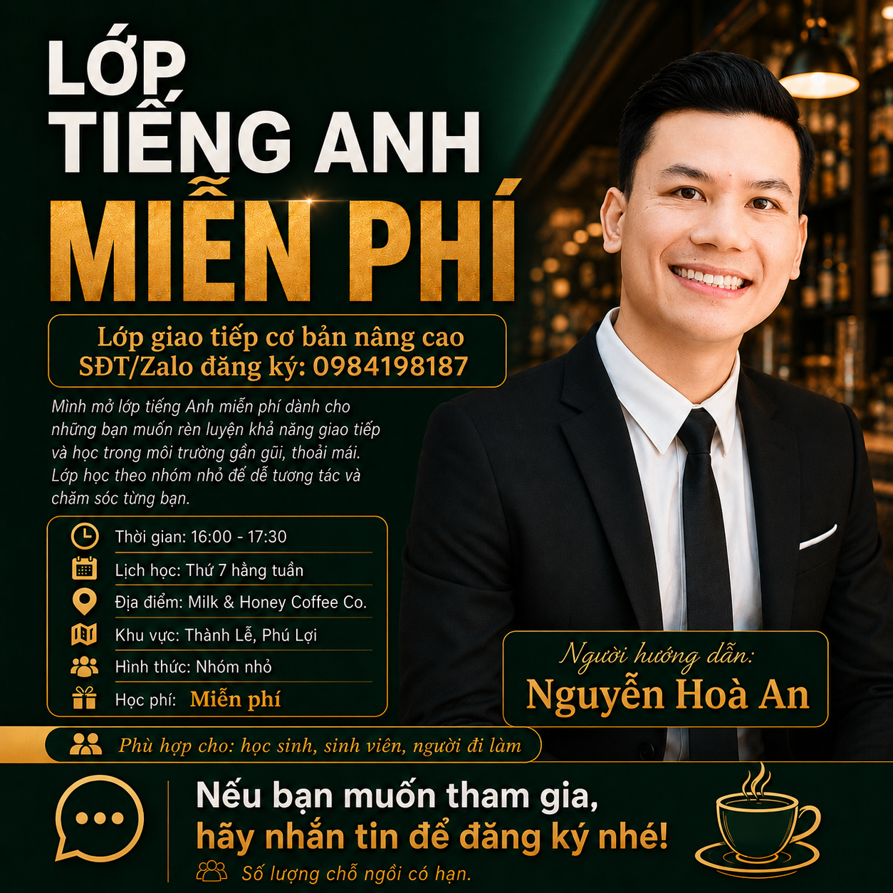

# Lớp Tiếng Anh Giao Tiếp Miễn Phí - Website

A complete, polished, responsive one-page website for a free English communication class built with plain HTML, CSS, and JavaScript.

## 📋 Project Overview

This website was created to promote a free English communication class (Lớp Tiếng Anh Giao Tiếp Miễn Phí) taught by Nguyễn Hoà An in Bình Dương, Vietnam. The site is warm, trustworthy, professional, and community-oriented—designed to feel like a genuine educational initiative, not a commercial language center.

### Key Features

✅ Fully responsive (mobile, tablet, desktop)  
✅ No external dependencies or build tools required  
✅ Plain HTML, CSS, and JavaScript only  
✅ SEO optimized with meta tags and semantic HTML  
✅ Smooth scrolling navigation with active link highlighting  
✅ Mobile hamburger menu  
✅ Accordion FAQ section  
✅ Embedded Google Maps  
✅ Phone and Zalo contact buttons  
✅ Placeholder SVG images for easy replacement  
✅ Dark mode support  
✅ Accessibility features (WCAG compliant)  
✅ Subtle animations and transitions  

---

## 🚀 Quick Start

### 1. Preview Locally

Simply open `index.html` in your web browser:

```bash
# Option 1: Double-click index.html in file explorer
# Option 2: Open in your editor and use "Live Server" extension (VS Code, etc.)
# Option 3: Use Python's built-in server (Mac/Linux/Windows)
python3 -m http.server 8000
# Then visit: http://localhost:8000
```

The website is fully functional without any server or build process.

---

## 📝 File Structure

```
englishclass/
├── index.html           # Main website file (semantic HTML)
├── style.css            # All styling (mobile-first responsive)
├── script.js            # All interactivity (vanilla JavaScript)
├── README.md            # This file
└── assets/
    └── images/
        ├── teacher-placeholder.svg    # Replace with teacher.jpg
        ├── family-placeholder.svg     # Replace with family.jpg
        └── class.png                  # Class poster
```

---

## 🖼️ Replacing Placeholder Images

### Step 1: Prepare Your Images

Convert your photos to the following formats and sizes:

- **teacher.jpg** - Portrait photo of you (400x400px minimum)
- **family.jpg** - Family/personal photo (400x300px minimum)
- **class.png** - Class poster or group learning image (400x300px minimum)

Place them in the `assets/images/` folder.

### Step 2: Update Image References

Open `index.html` and find the image tags (use Ctrl+F / Cmd+F to search):

**For teacher photo:**
```html
<!-- Around line 240 -->

<!-- Change to: -->

```

**For family photo:**
```html
<!-- Around line 310 -->

<!-- Change to: -->

```

**For class photo:**
```html
<!-- Around line 125 -->

<!-- Change to: -->

```

---

## ✏️ Customizing Content

### Essential Information to Update

#### 1. Teacher Name

Currently: "Nguyễn Hoà An"

Search for this name in `index.html` and replace with your own.

#### 2. Phone Number (Multiple locations)

Current: `0984198187`

Replace with your phone number throughout the file. Use Ctrl+F to find all occurrences.

#### 3. Class Location Details

Search for "Thành Lễ, Phú Lợi, Thủ Dầu Một, Bình Dương" and update with your actual location.

#### 4. Google Maps Link

Current: `https://maps.app.goo.gl/FirWhcAUQLnACN4VA`

Replace with your actual Google Maps location link.

#### 5. Class Schedule

Current: "16:00–17:30 mỗi thứ bảy"

Update to your actual schedule.

#### 6. Teacher Biography

Replace the teacher bio section with your own genuine introduction.

---

## 🎨 Customizing Design

### Colors

All colors are defined in `style.css` in the `:root` section. Modify variables like:

```css
--primary: #3b82f6;      /* Main blue */
--secondary: #06b6d4;    /* Cyan accent */
```

### Spacing & Typography

Adjust spacing, fonts, and other design elements in `style.css`.

---

## 📱 Mobile Responsiveness

The website is fully responsive and works beautifully on:
- Mobile phones (320px and up)
- Tablets
- Desktop screens

Test on your phone or use browser DevTools (F12) to check responsiveness.

---

## 🔍 SEO

The website includes:
- Proper meta tags for search engines
- Open Graph tags for social media
- Semantic HTML structure
- Vietnamese language optimization

---

## 🌐 Publishing with GitHub Pages

### Quick Steps:

1. **Create GitHub account** at https://github.com
2. **Create a new repository** named `englishclass`
3. **Upload all files** (index.html, style.css, script.js, assets folder)
4. **Enable GitHub Pages**:
   - Go to Settings → Pages
   - Select "main" branch as source
   - Save

Your website will be live at: `https://YOUR_USERNAME.github.io/englishclass/`

---

## ✅ Pre-Launch Checklist

- [ ] Replace all placeholder SVG images with your photos
- [ ] Update phone number (all occurrences)
- [ ] Update location details
- [ ] Update Google Maps link
- [ ] Update teacher name and biography
- [ ] Test all links work (phone, Zalo, Maps)
- [ ] Test on mobile and desktop
- [ ] Test FAQ accordion
- [ ] Verify Vietnamese text displays correctly
- [ ] Deploy to GitHub Pages
- [ ] Test final live website

---

## 🐛 Troubleshooting

### Images not showing
- Verify file paths in index.html
- Ensure files are in `assets/images/` folder
- Check file names match exactly (case-sensitive)

### Links not working
- Phone: `tel:0984198187`
- Zalo: `https://zalo.me/0984198187`
- Maps: Use Google Maps short link

### Mobile issues
- Clear browser cache
- Refresh page
- Test in incognito/private mode

---

## 🎉 Done!

Your English class website is ready to go. Chúc bạn thành công! (Good luck!)
